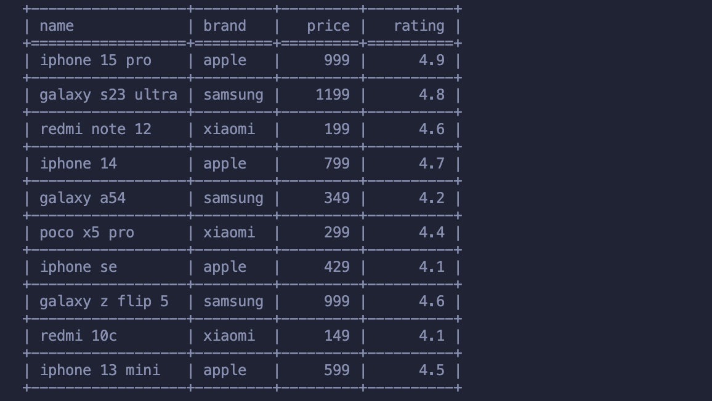
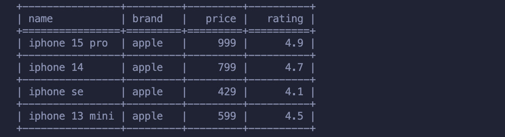
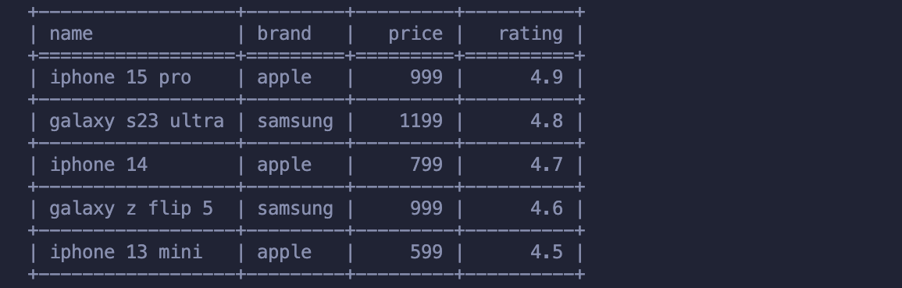
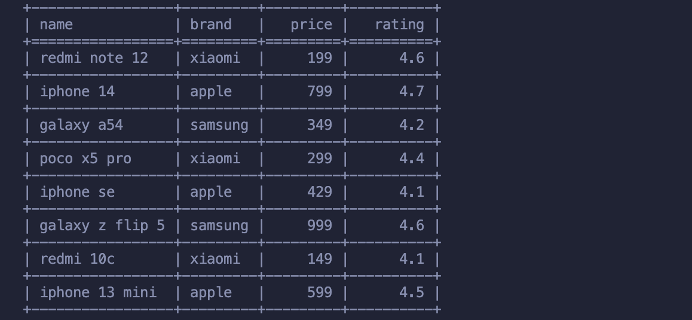
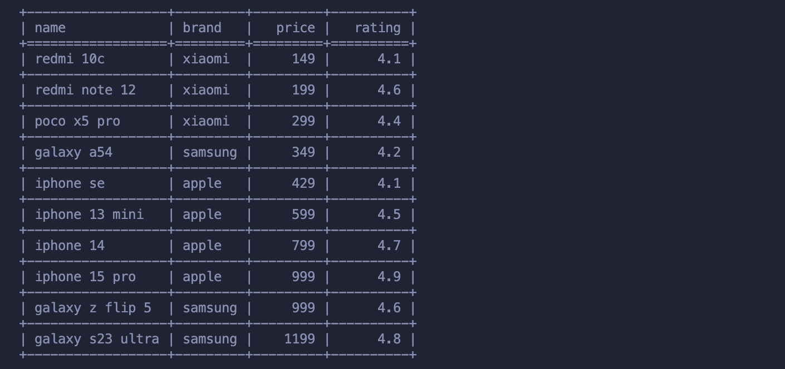
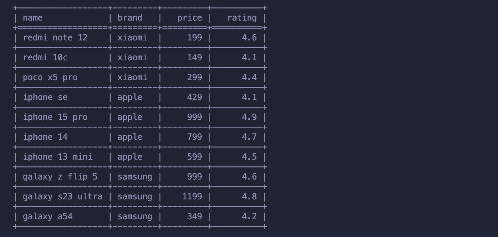
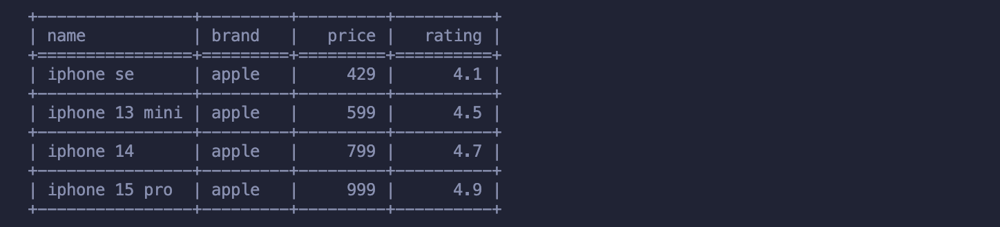

# CSV Query Tool

Утилита для обработки CSV-файлов с поддержкой фильтрации и агрегации данных.

## Возможности

- Чтение CSV-файлов с произвольными колонками
- Фильтрация данных с операторами `>`, `<`, `=`
- Сортировка данных по возрастанию (asc) или убыванию (desc)
- Агрегация данных: среднее (avg), минимум (min), максимум (max)
- Красивый вывод в виде таблицы

## Требования

- Python 3.13+
- Зависимости: `tabulate`

## Установка

1. Клонируйте репозиторий
2. Установите зависимости:

```bash
poetry install
```

## Использование

### Базовый синтаксис

```bash
python main.py --file <filename.csv> [--where 'column>value'] [--order-by 'column=order'] [--aggregate 'column=operation']
```

Где:

- `--file` - путь к CSV файлу (обязательный параметр)
- `--where` - условие фильтрации (необязательно)
- `--order-by` - сортировка (необязательно, формат: `колонка=порядок`, где порядок: `asc` или `desc`)
- `--aggregate` - агрегация данных (необязательно)

### Примеры

1. Вывести все данные из файла:

```bash
python main.py --file ./data/products.csv
```



2. Отфильтровать по точному совпадению:

```bash
python main.py --file ./data/products.csv --where 'brand=apple'
```



3. Найти товары дороже 500:

```bash
python main.py --file ./data/products.csv --where 'price>500'
```



4. Найти товары с рейтингом ниже 4.8:

```bash
python main.py --file ./data/products.csv --where 'rating<4.8'
```



5. Посчитать среднюю цену по всем товарам:

```bash
python main.py --file ./data/products.csv --aggregate 'price=avg'
```


6. Средняя цена товаров xiaomi:

```bash
python main.py --file ./data/products.csv --where 'brand=xiaomi' --aggregate 'price=avg'
```


7. Поиск самого дорогого товара:

```bash
python main.py --file ./data/products.csv --aggregate 'price=max'
```


8. Средняя цена премиальных товаров (от 800):

```bash
python main.py --file ./data/products.csv --where 'price>800' --aggregate 'price=avg'
```


9. Минимальная цена на товары Samsung:

```bash
python main.py --file ./data/products.csv --where 'brand=samsung' --aggregate 'price=min'
```


10. Средняя цена товаров с рейтингом выше 4.5:

```bash
python main.py --file ./data/products.csv --where 'rating>4.5' --aggregate 'price=avg'
```


11. Максимальный рейтинг товаров Apple:

```bash
python main.py --file ./data/products.csv --where 'brand=apple' --aggregate 'rating=max'
```


12. Сортировка товаров по цене по возрастанию:

```bash
python main.py --file ./data/products.csv --order-by 'price=asc'
```



13. Сортировка товаров по названию в обратном алфавитном порядке:

```bash
python main.py --file ./data/products.csv --order-by 'name=desc'
```



14. Фильтрация и сортировка: самые дешевые товары Apple:

```bash
python main.py --file ./data/products.csv --where 'brand=apple' --order-by 'price=asc'
```



15. Средняя цена товаров с рейтингом выше 4.5, отсортированных по убыванию цены:

```bash
python main.py --file ./data/products.csv --where 'rating>4.5' --order-by 'price=desc' --aggregate 'price=avg'
```


## Форматы данных

- Фильтрация: `--where 'column>value'` (поддерживаются >, <, =)
- Сортировка: `--order-by 'column=order'` (order: asc для возрастания, desc для убывания)
- Агрегация: `--aggregate 'column=operation'` (доступно: avg, min, max)

## Ограничения

- Все данные считываются как строки, но для числовых колонок доступно числовое сравнение
- Фильтрация работает с любыми типами данных (сравнение строк чувствительно к регистру)
- Сортировка работает с любыми типами данных (числа сортируются численно, остальные - лексикографически)
- Агрегация работает только с числовыми колонками
- Поддерживается только один фильтр, одна сортировка и одна агрегация за запуск

## Запуск тестов

```bash
# Запуск всех тестов
pytest

# Запуск тестов в компактном режиме
pytest -q
```
